# Introduction to the CSCS cluster

The [CSCS cluster](https://www.cscs.ch/) is a cluster built for Swiss researchers that provides national high-performance computing. This cluster should be used for model training and inference:

- To connect to the cluster: see [this](cscs.md)
- To build images for the cluster: see [this](cscs_docker.md)

Here is the overview of the architecture:

```mermaid
architecture-beta
    group api[CSCS cluster]
    group nodes[GPU nodes] in api
    
    service laptop(mids:laptop)[Your Laptop]
    service storage(database)[Storage] in api
    service login(server)[Login node] in api

    service node1(server)[nid0000] in nodes
    service node2(server)[nid0001] in nodes
    service node3(server)[nid0002]in nodes
    service node4(server)[nid0003]in nodes

    junction junctionStorage in api
    
    laptop:R --> L:login

    login:B -- T:storage
    login:R --> L:node1{group}

    junctionStorage:T -- B:node1{group}
    storage:R -- L:junctionStorage

    node1:T -- B:node2
    node1:R -- L:node3
    node2:R -- L:node4
    node3:T -- B:node4
```

